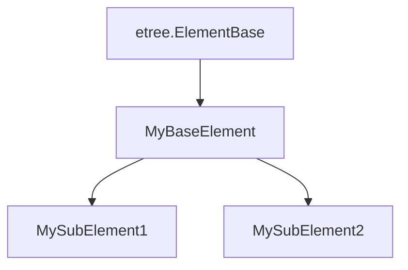

[](https://pypi.org/project/types-lxml/)


## Important note

- Since `2025.03.04`:
  - `BeautifulSoup4` package is added as dependency to utilise its inline annotation, thus dropping `types-beautifulsoup4` dependency.
  - Fixes compatibility with older versions of type checkers, as well as `mypy` 1.14+.

- Since `2025.02.24`:
  - Incorporates [`basedpyright`](https://github.com/DetachHead/basedpyright) type checker support (an enhanced fork of `pyright`)


- Since `2024.11.08`:
  - `pyright` users will see warning if a single string is supplied where collection of string is expected (`tuple`, `set`, `list` etc). In terms of typing, a single `str` itself is valid as a `Sequence`, so type checkers normally would not raise alarm when using `str` in such function parameters, but can induce unexpected runtime behavior. See [#64](https://github.com/abelcheung/types-lxml/issues/64) for more info. `mypy` does not support this feature (which (ab)uses `@deprecated` warning).
  - It is possible to verify release files indeed come from GitHub and not maliciously altered. See [Release file attestation](#release-file-attestation) for detail.

- Since `2024.08.07`:
  - Each release will contain multiple builds; besides normal version, there is an alternative build suitable for multiple XML element subclass. Please check out [relevant Installation section](#choosing-the-build) for detail (hint: many people don't need to bother with this). Also note that this release requires `mypy 1.11` if one chooses to use `mypy` for type checking. `pyright` version requirement (`1.1.351`) is not changed.

## Introduction

This repository contains [external type annotations](https://peps.python.org/pep-0561/) for [`lxml`](http://lxml.de/). It can be used by [type-checking tools](#goal---support-multiple-type-checkers) to check code that uses `lxml`, or used within IDEs like [VSCode](https://code.visualstudio.com/) to facilitate development.

## Goal ① : Completion

Now the coverage of `lxml` submodules is complete (unless intentionally rejected, see further below), thus no more [considered as `partial`](https://peps.python.org/pep-0561/#partial-stub-packages):
  - [x] `lxml.etree`
  - [x] `lxml.html`
    - [x] `lxml.html.builder`
    - [x] `lxml.html.clean` (already removed in lxml 5.2.0, this project will follow suite in future)
    - [x] `lxml.html.diff`
    - [x] `lxml.html.html5parser`
    - [x] `lxml.html.soupparser`
  - [x] `lxml.isoschematron`
  - [x] `lxml.objectify`
  - [x] `lxml.builder`
  - [x] `lxml.cssselect`
  - [x] `lxml.sax`
  - [x] `lxml.ElementInclude`

Following submodules will not be implemented due to irrelevance to type checking or other reasons:

  - `lxml.etree.Schematron` (obsolete and superseded by `lxml.isoschematron`)
  - `lxml.usedoctest`
  - `lxml.html.usedoctest`
  - `lxml.html.formfill` (shouldn't have existed, this would belong to HTTP libraries like `requests` or `httpx`)

Check out [project page](https://github.com/abelcheung/types-lxml/projects) for future plans and progress.

## Goal ② : Support multiple type checkers

Currently the annotations are validated for following type checkers:

- [`basedpyright`](https://github.com/DetachHead/basedpyright), version 1.4.0 or above
- [`pyright`](https://github.com/microsoft/pyright), version 1.1.351 or above
- [`mypy`](https://github.com/python/mypy), version 1.10.0 or above

`pyright` and `basedpyright` are recommended for their greater flexibility and early adoption of newer type checking features. In the future, there is plan to bring even more type checker support.

## Goal ③: Review and test suite

- [x] All prior `lxml-stubs` contributions are reviewed thoroughly, bringing coherency of annotation across the whole package
- [x] Perform runtime check, and compare against static type checker result; this guarantees annotations are indeed working in real world, not just within some cooked up test suite
- [x] Existing static test suite already vastly expanded, and is under progress of migrating to runtime test
- [x] Modernize package building infrastructure

## Goal ④ : Support for IDEs

Despite having no official PEP, some IDEs support showing docstring from external annotations. This package tries to bring type annotation specific docstrings for some `lxml` classes and functions, explaining how they can be used. Following screenshots show what would look like in Visual Studio Code, behaving as if docstrings come from real python code:


Besides docstring, current annotations are geared towards convenience for code writers instead of absolute logical 'correctness'. The [deviation of class inheritance](https://github.com/abelcheung/types-lxml/wiki/Element-inheritance-change) for `HtmlComment` and friends is one prominent example.


## Installation

The normal choice for most people is to fetch package from PyPI, like:

    uv pip install -U types-lxml  # using uv
    pip install -U types-lxml  # using pip

In the unlikely case PyPI is down, one can directly download wheel from [latest release in GitHub](https://github.com/abelcheung/types-lxml/releases/latest), and then perform installation as local file.

As convenience, it is possible to pull type checker directly [with extras](https://peps.python.org/pep-0508/#extras):

    uv pip install -U types-lxml[pyright]
    pip install -U types-lxml[mypy]

### Choosing the build

Since `2024.08.07` release, there will be two versions of `types-lxml`. First one is the default one; if there's no problem using it, there's no need to switch.

The second version, `types-lxml-multi-subclass`, is intended for specific need, namely creation of multiple lxml element subclasses. For example:



If a parsed or constructed element tree consists of single type of element nodes, it is safe to assume the children or parent of a node are of the same type too. But this assumption does not hold for multiple subclasses. Using diagram above as example, calling `.iter()` method from `MyBaseElement` node may produce element of any subelement or even `MyBaseElement` itself.
Therefore output type should be simply `MyBaseElement` only.

Such scenario is already in effect for `lxml.html`. `<form>` element (`FormElement`) is supposed to contain other form related tags like `<input>`, `<select>` etc. But we can't possibly pinpoint single subelement type, so `<form>` children can only possibly be of type `HtmlElement`. The multiple subelement scenario is already hardcoded for `HtmlElement` and `ObjectifiedElement` within this annotation package, but users may choose to have their own overridden element subclasses (inherit from `ElementBase`) too.

The 2 paradigms can't coexist within a single type annotation package. See [bug #51](https://github.com/abelcheung/types-lxml/issues/51) that illustrated why multiple build is necessary.

Remember that anybody can only choose one of the 2 builds. It is impossible to install both, as `pip` just [arbitrarily overwrite conflicting files with one another](https://github.com/pypa/pip/issues/4625). If in doubt, removing existing package first, then install the one you needed.


### Release file attestation

Since `2024.11.08` users can download `types-lxml` release files and verify that they indeed do originate from GitHub. For those haven't heard of it, this is sort of like `gnupg` or [`minisign`](https://jedisct1.github.io/minisign/) signatures, but with GitHub backed infrastructure.

After downloading release wheel file (say `pip download types-lxml`, or browser access to PyPI directly), one can use [GitHub cli](https://cli.github.com/) to verify it comes from this GitHub repository without being altered:

```
gh at verify types_lxml-2024.11.8-py3-none-any.whl --repo abelcheung/types-lxml
```

Should generate following result:

```
Loaded digest sha256:4b4fa7f9e2f1d5f58b98ac9852a75927e4e0f69363249f9cebc78db095c046e0 for file://types_lxml-2024.11.8-py3-none-any.whl
Loaded 1 attestation from GitHub API
✓ Verification succeeded!

sha256:4b4fa7f9e2f1d5f58b98ac9852a75927e4e0f69363249f9cebc78db095c046e0 was attested by:
REPO                   PREDICATE_TYPE                  WORKFLOW
abelcheung/types-lxml  https://slsa.dev/provenance/v1  .github/workflows/release.yml@refs/tags/2024.11.08
```


## History

Type annotations for `lxml` were initially included in [typeshed](https://www.github.com/python/typeshed), but as it was still incomplete at that time, the stubs are [ripped out as a separate project](https://github.com/python/typeshed/issues/525). The code was since then under governance of lxml, until 2022 when this fork intended to revamp `lxml-stubs` completely and emerge into separate project.

`types-lxml` is a fork of `lxml-stubs` that strives for the goals described above, so that most people would find it more useful.
